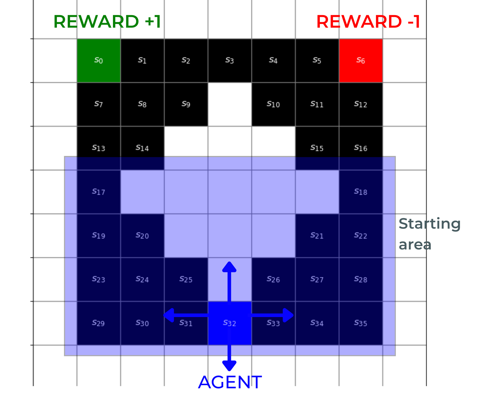
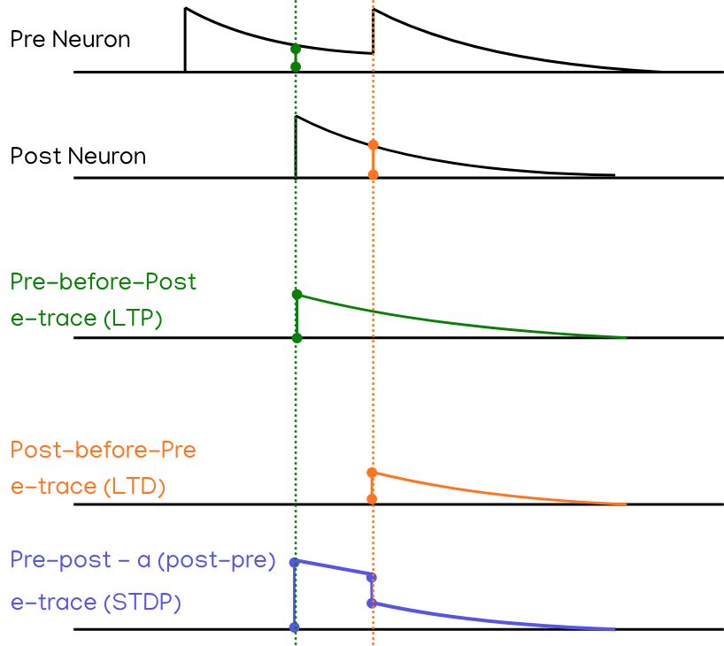

# EvoPlaSNN: Evolving Reward-modulated ANN-based Plasticity Rule for Spiking Neural Networks

Napat Sahapat, Sérgio F. Chevtchenko, Yeshwanth Bethi and Saeed Afshar

Main author of repository: Napat Sahapat

Presented in GECCO 2026

DOI: tba

---
# Introduction

Aim is to build a Spiking Neural Network (SNN) simulator from scratch, and apply a basic 
Evolutionary Algorithm to evolve the plasticity rules which control the weight updates of each SNN

---
# Methodology

A meta-learning experiment such as ours consists of two optimisation loops: an outer loop for finding solution and an inner loop for evaluating each solution.

In the outer loop, learning rules are optimised through evolutionary algorithms by going through successive generations. In the inner loop, each learning rule is evaluated by training a SNN to solve RL problem. A "lifetime" or trial starts with an randomly initialised SNN which goes through various episodes of the RL problem, progressively being trained by a single learning rule. Each learning rule can be evaluated for multiple trials.

## Environment

The RL task being solved by the SNN agent is a custom-modified version of the classic T-Maze. This so-called "Donut Maze" is a 7x7 grid with an impassible hole in the centre and two terminal goals at the upper corners: one with a positive reward and one with a negative reward. An agent is randomly initialised in one of the cells in the lower region and must learn to navigate successfully to the positive goal.

The agent receives state observation through a one-hot encoded representation of the current cell position. Each cell corresponds to a state number, and a spike is emitted for the state the agent is located in. This is similar to place cell representation found in neurological studies \cite{o1971hippocampus}, except it is more discrete than other SNN implementations \cite{fremaux_reinforcement_2013}. The action interpreted from the output spikes of the SNN agent belongs to one of four cardinal actions: up, down, left, right. If the network fails to spike in a given timestep, the agent remains in the same position, but the step count is incremented.

An episode ends either when the agent reaches one of the goal, or the maximum number of $200$ steps has been reached. The reward is only given at the end of an episode: $+1$ for reaching the positive goal, $-1$ for the negative goal, and $0$ for episode truncation. 

## SNN

The SNN agent acts as a decision-making policy for the RL environment (Section \ref{sec:method_rl}), and is trained via the ANN-based Learning Rule (Section \ref{sec:method_lrule}).

The Simulator for SNN is implemented from first principles of neuron dynamics, using basic libraries such as `numpy` in Python. Although it lacks the computational efficiency found in other third-party simulators such as NEST, we had greater control over how the neurons and synapses are implemented, as well as how the learning rule interacts with the network.

The architecture of the SNN consists of a single layer of four LIF neurons corresponding to the actions of the RL Problem (see above). The LIF neuron layer is fully-connected to an input layer of 36 channels corresponding to the state representation. There are no hidden layers in the SNN. 

### Neuron Models

Our SNN Simulator relied on a simplified version of a LIF Neuron with WTA mechanics and no synaptic delay. In other words, upon receiving an input spike, the membrane potential of a LIF neuron would rise instantly, then gradually decay afterwards with a time constant $\tau$.

$$\frac{d}{dt}V_j(t) = - \frac{V_j(t)}{\tau_{mem}} + \sum_{i \in \mathbf{I_j}}\sum_{t^f_i}{\mathit{w}_{ij}\delta(t-t^f_i)}$$

where $V_j(t)$ is the membrane potential of post-synaptic neuron $j$ at timestep $t$, $\tau_{mem}$ is the time constant for the membrane dynamics, $\mathbf{I_j}$ is the set of pre-synaptic neurons connected to neuron $j$, $t^f_i$ is the spike firing times for pre-synaptic neuron $i$, $w_{ij}$ is the synaptic weight between neurons $i$ and $j$, and $\delta(t)$ is the Dirac Delta function.

The WTA mechanic is implemented by only allowing one neuron to fire at any given timestep. This choice can be selected deterministically (during evaluation), or stochastically based on the current value of the membrane potential of neurons within the same layer. This is to facilitate exploration within an RL environment. The stochasticity is calculated via the softmax function, with a temperature parameter, $\beta$, which governs the degree of stochasticity. Thus, the probability $ P_j(t)$ that neuron $j$ spikes at time $t$ is given by:

$$P_j(t) = \text{softmax}(V_j(t)) = \frac{e^{\beta V_j(t)}}{\sum_{k \in \mathcal{K}}{e^{\beta V_k}}}$$

where $V_j(t)$ is the membrane potential of neuron $j$ at time $t$ and $\mathcal{K}$ contains all neurons within the same layer as neuron $j$.

After a winner neuron spikes, its membrane potential gets reset to zero immediately, while the membrane potential of neighbouring neurons are not affected (subject to exponential decay).

### Neuron Trace

Neuron activities are represented through the "trace" of neuron, an exponentially decaying variable which tells how recent a neuron has emitted a spike. In STDP updates, these traces are used as proxies for the spike time differences between pre- and pots-synaptic activities \cite{morrison_phenomenological_2008}. In our simulation, both the input and output layers contain neuron traces, which is described as:

$$\frac{d}{dt}x_i(t) = - \frac{x_i(t)}{\tau_{trace}} + (1 - x_i(t)) \sum_{t^f_i}{\delta(t - t^f_i)}$$

where $x_i(t)$ is the trace of neuron $i$ at time $t$, $\tau_{trace}$ is the time constant for trace, and $t^f_i$ is the spike firing time of neuron $i$. The term $(1-x_i)$ is to ensure trace always reset to $1$ when a spike occurs so as to prevent unbounded trace values.

These trace values are utilised when calculating plasticity variables such as LTP and LTD

### Eligibility Traces

To account for reward signal which occurs at a future delayed timestep,
each synapse keeps track of an \*eligibility trace\* which depends on
the neuron traces and spike times of the *pre-synaptic* and
*post-synaptic* neurons connected to that synapse.

We consider 3 types of eligibility traces: LTP, LTD and STDP. Since LTP occurs when a synapse is strengthened whenever a post-synaptic spike occurs right after a pre-synaptic spike, we update the LTP trace ("pre-before-post") whenever a post-synaptic spike occurs using the current trace of the pre-synaptic neuron (Equation \ref{eq:etrace-ltp}). 

Conversely, since LTD weakens a synaptic connection whenever a pre-synaptic spike occurs soon after a post-synaptic spike, we update the LTD eligibility trace ("post-before-pre") whenever a pre-synaptic spike occurs using the current trace of the post-synaptic neuron (Equation \ref{eq:etrace-ltd}). 

Finally, for a combined STDP eligibility trace, we update both the pre-before-post and post-before-pre signals concurrently. To balance out the LTP and LTD components when both pre- and post-synaptic spikes occur at the same time, we introduce an $\alpha$ coefficient which controls the magnitude of the LTD contribution, which is usually lower than LTD (Equation \ref{eq:etrace-stdp}).

$$\frac{d}{dt}E_{\mathrm{LTP}} = - \frac{E_{\mathrm{LTP}}}{\tau_{syn}} + \sum_{t^f_j}x_i(t)\cdot{\delta(t - t^f_j)}$$

$$\frac{d}{dt}E_{\mathrm{LTD}} = - \frac{E_{\mathrm{LTD}}}{\tau_{syn}} +  \sum_{ t^f_i}x_j(t)\cdot{\delta(t - t^f_i)}$$

$$\frac{d}{dt} E_{\mathrm{STDP}} = - \frac{E_{\mathrm{STDP}}}{\tau_{syn}} +   \left[\sum_{t^f_j}x_i(t)\cdot{\delta(t - t^f_j)} - \alpha \sum_{t^f_i}x_j( t)\cdot{\delta(t - t^f_i)}\right]$$

where $\tau_{syn}$ is a shared time-constant for all three types of eligibility trace, $x_i, x_j$ are the neuron traces for the pre- and post-synaptic neurons respectively, $t_i^f, t_j^f$ are the spike times for the pre- and post-synaptic neurons respectively, and $\alpha$ is a coefficient controlling the strength of LTD. Although not shown in the equations, all types of eligibility trace are also capped to not exceed the value of $1$ to prevent exploding values from occuring.

## Learning Rule Representation

Contrary to recent push towards more interpretability \cite{jordan_evolving_2021, confavreux_balancing_2025}, we have opted for a more black-box approach to represent learning rules. While we sacrificed interpretable rules, we hoped to gain more flexibility in computational capability. 

The learning rule is represented as a fully-connected rate-based ANN, or MLP, consisting of one hidden layer of three neurons plus bias neurons for the input and hidden layers. The floating-value weights of this "ANN Rule" when rearranged as a flat vector, becomes the genome through which EA will operate on.

There are 3 inputs to this learning rule: eligibility trace (as described above), global reward, and current synaptic weight. There is only one output value, which controls the synaptic weight change for each synapse. Together with 3 inputs (plus bias), 3 hidden neurons (plus bias) and 1 output, there are a total of 16 weight values ($[4 \times 3] + [4 \times 1]$), or a genome size of 16.

During implementation, the same learning rule is applied \textit{in-bulk} to all synapses at the same, when the reward is received at the end of an RL episode. The weight changes, $\Delta{w}$ is multipled with the learning rate $\eta$ then added to the current weights.

Since our research question concerns what influence each input to the learning rule would be, we have tested out 6 combinations of inputs to the ANN-based learning rule in total:

- $f(\text{reward}, e_{LTP})$
- $f(\text{reward}, E_{LTP}, E_{LTD})$
- $f(\text{reward}, E_{STDP})$
- $f(\text{reward}, \text{weight}, E_{LTP})$
- $f(\text{reward}, \text{weight}, E_{LTP}, E_{LTD})$
- $f(\text{reward}, \text{weight}, E_{STDP})$

We wanted to know whether including synaptic weights has an impact on learning capability. The eligibility trace for LTP is more important than that for LTD, so we did not include one for $E_{LTD}$ by itself. As for STDP trace, it encapsulates both LTP and LTD, hence the exclusion both each of those separate eligibility traces.

Reward is necessary in reward-modulated learning, which is why it is included as inputs in all combinations. We have considered adding a reward baseline such as running average reward across episodes, as was mentioned in \cite{jordan_evolving_2021}, but we believe that, due to the different starting position for each episode and the different trajectory of actions taken by the agent in each episode, a running average of rewards does not provide enough information to be useful as a baseline value.

Thus, the learning rule can be written as:

$$\Delta{w_{ij}} = \eta \mathcal{f}_{\mathrm{ANN}}(...)$$

where $\Delta{w_{ij}}$ is the change in synaptic weight from neuron $i$ to $j$, $f_{\mathrm{ANN}}$ is the ANN} which represents the learning rule, and $(...)$ corresponds to the six input combinations described above. 

## Fitness Evaluation

The final fitness of each individual is the average episode reward across all episodes of the evaluation phase, across all trials:

$$\mathcal{F}_{indiv} = \frac{1}{N_{eval}T}\sum^{T}_{t}{\sum^{N_{eval}}_{n}{R(n)}}$$

where $R(n)$ is the final reward at the end of episode $n$, $N_{eval}$ is the number of evaluation episodes and $T$ is the number of trial.

## Evolution Algorithm

We have opted for the CMA-ES algorithm due to its simplicity yet powerful and versatile performance. 

CMA-ES is a probabilistic evolutionary algorithm, meaning the individuals in each generation is sampled anew from a multivariate normal distribution $\mathcal{N}(\mathbf{m}, \mathbf{C})$ (where $\mathbf{m}$ is the mean vector and $\mathbf{C}$ is the covariance matrix) \cite{hansen_cma_2023}. After each individual has been evaluated, their fitness values are used to modify the mean and covariance of the search distribution in the next generation. The new mean is calculated based on $n_{best}$ individuals in the previous generations ranked by fitness. ($n_{best} = \frac{1}{2}\mathrm{popsize}$)

The version we adopted is a slightly simplified implementation of CMA-ES, which includes the Rank-$\mu$ and Rank-$1$ covariance update but omitting the step-size control (Equation 30 in \cite{hansen_cma_2023}).

The evolution process runs for 100 generations. Within each generation, there are 20 individuals (or learning rules). To evaluate each individual, 20 trials are performed. Within each trial, an SNN with randomly initialised uniformly-distributed weights is trained with the given learning rule for 100 training episodes, followed by 20 evaluation episodes where the weights remain static. 

In one evolution run, only the individual with the highest fitness at the final generation is considered the winner, and comparisons between runs are only made with this final individual. However, data about fitness and genome of individuals in every generations throughout a single run is still retained for future within-run analysis.

---
# Overview

All of the code for the experiments are in the `src/` directory, which consists of the following modules:
- `common`: Contains helper functions and factory methods
- `evo`: All code relating to evolutionary optimisation
- `lrule`: Learning Rule representation
- `snn`: Spiking Neural Network, Simulator, Spike Coding, Neurons, Synapses and Plotting functions
- `rl`: Maze Environment for RL evaluation

---
